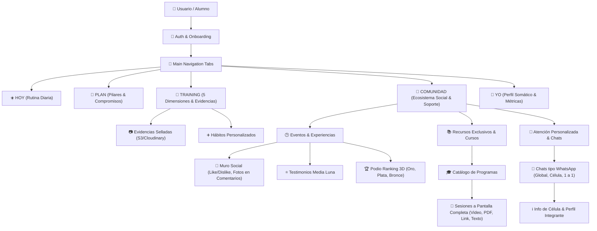

# 🏗️ ESQUEMA DE ARQUITECTURA DE DATOS & INTEGRACIÓN (RENASER 90 DÍAS)

Este documento define la **Arquitectura Maestra de Datos, Modelos Relacionales (PostgreSQL / Supabase) y Endpoints de API** para conectar el Frontend React Native con el Backend de forma escalable, limpia y sin refactorizaciones.

---

## 🏛️ 1. Diagrama de Módulos del Sistema

---

## 🗄️ 2. Modelos Relacionales de Base de Datos (PostgreSQL / Supabase)

### 🧑‍💼 `users` & `profiles`
| Campo | Tipo | Descripción |
| :--- | :--- | :--- |
| `id` | `UUID (PK)` | Identificador único del usuario |
| `email` | `VARCHAR(255) UNIQUE` | Correo electrónico de acceso |
| `full_name` | `VARCHAR(150)` | Nombre completo del alumno |
| `role` | `ENUM('student', 'mentor', 'coach', 'admin')` | Rol en la plataforma |
| `current_day` | `INTEGER DEFAULT 1` | Día activo en el programa (1 al 90) |
| `current_phase` | `INTEGER DEFAULT 1` | Fase activa (1: Fundación, 2: Aceleración, 3: Maestría) |
| `cell_id` | `UUID (FK -> cells.id)` | Célula asignada (ej. Célula 07) |
| `streak_days` | `INTEGER DEFAULT 0` | Días consecutivos cumplidos |
| `evidence_percent` | `NUMERIC(5,2) DEFAULT 0` | Porcentaje de cumplimiento |
| `created_at` | `TIMESTAMPTZ` | Fecha de registro |

---

### 💎 `habits` & `habit_evidences` (Training)
| Campo | Tipo | Descripción |
| :--- | :--- | :--- |
| `id` | `UUID (PK)` | ID del hábito |
| `user_id` | `UUID (FK -> users.id)` | Dueño del hábito |
| `dimension` | `ENUM('CUERPO', 'MENTE', 'EMOCIONES', 'ESPÍRITU', 'VIDA Y NEGOCIO')` | Dimensión somática |
| `title` | `VARCHAR(255)` | Nombre de la práctica |
| `scheduled_time` | `VARCHAR(100)` | Horario (ej. '05:00 AM · Mañana') |
| `tag` | `VARCHAR(50)` | Prioridad ('INNEGOCIABLE', 'SALUD', 'ENERGÍA', etc.) |
| `is_custom` | `BOOLEAN DEFAULT false` | Si fue creado por el alumno |

**`habit_evidences`**:
* `id` (`UUID PK`)
* `habit_id` (`UUID FK`)
* `user_id` (`UUID FK`)
* `day_number` (`INTEGER`)
* `photo_url` (`TEXT` - S3/Storage)
* `truth_note` (`TEXT` - Registro de Verdad)
* `sealed_at` (`TIMESTAMPTZ`)

---

### 📚 `courses`, `course_sections` & `lessons` (Recursos Exclusivos)
* **`courses`**: `id`, `title`, `category`, `instructor_name`, `summary`, `cover_image_url`, `is_locked`, `unlock_at_day`.
* **`course_sections`**: `id`, `course_id`, `title`, `order_index`.
* **`lessons`**: `id`, `section_id`, `type` (`video`, `doc`, `link`, `text`), `title`, `meta`, `desc`, `media_url`, `content_markdown`.
* **`user_lesson_progress`**: `user_id`, `lesson_id`, `is_completed`, `completed_at`.

---

### 📢 `community_posts`, `reactions` & `comments` (Eventos & Experiencias)
* **`community_posts`**:
  * `id` (`UUID PK`), `author_id` (`UUID FK`), `tag` (`VARCHAR`), `text` (`TEXT`), `media_urls` (`JSONB`), `likes_count` (`INTEGER`), `dislikes_count` (`INTEGER`), `created_at`.
* **`post_reactions`**:
  * `post_id` (`UUID FK`), `user_id` (`UUID FK`), `type` (`ENUM('like', 'dislike')`), `created_at`.
* **`post_comments`**:
  * `id` (`UUID PK`), `post_id` (`UUID FK`), `author_id` (`UUID FK`), `text` (`TEXT`), `photo_url` (`TEXT`), `likes_count`, `dislikes_count`, `created_at`.

---

### 💬 `conversations` & `chat_messages` (Atención Personalizada / WhatsApp)
* **`conversations`**:
  * `id` (`UUID PK`), `type` (`ENUM('celula', 'direct', 'global')`), `title`, `subtitle`, `cell_id` (`UUID FK nullable`), `created_at`.
* **`conversation_participants`**:
  * `conversation_id` (`UUID FK`), `user_id` (`UUID FK`), `last_read_at` (`TIMESTAMPTZ`).
* **`chat_messages`**:
  * `id` (`UUID PK`), `conversation_id` (`UUID FK`), `sender_id` (`UUID FK`), `type` (`ENUM('text', 'audio', 'image_grid', 'video', 'gif')`), `text` (`TEXT`), `media_urls` (`JSONB`), `audio_url` (`TEXT`), `audio_duration` (`VARCHAR`), `gif_title` (`VARCHAR`), `gif_icon` (`VARCHAR`), `created_at` (`TIMESTAMPTZ`).

---

## 🔌 3. Endpoints REST & WebSockets Recomendados

### 🔐 Autenticación & Perfil
* `POST /api/auth/login`
* `POST /api/auth/register`
* `GET /api/users/me`
* `POST /api/onboarding/complete`

### 💎 Training & Hábitos
* `GET /api/habits?dimension={dim}`
* `POST /api/habits` (Crear hábito personalizado)
* `POST /api/habits/:id/evidence` (Subir y sellar foto de evidencia)

### 📚 Academia & Cursos
* `GET /api/courses`
* `GET /api/courses/:id`
* `POST /api/courses/lessons/:id/complete`

### 📢 Comunidad & Muro
* `GET /api/community/posts`
* `POST /api/community/posts`
* `POST /api/community/posts/:id/react` (Like / Dislike)
* `GET /api/community/posts/:id/reactions` (Quién dio Like)
* `POST /api/community/posts/:id/comments` (Con foto adjunta)
* `GET /api/community/ranking` (Leaderboard 3D)
* `GET /api/community/testimonials`

### 💬 Chats en Vivo (WebSockets / Supabase Realtime)
* `GET /api/chats/conversations?category={celula|miembros|global}`
* `GET /api/chats/:id/messages`
* `POST /api/chats/:id/messages` (Texto, audio, GIF, imágenes)
* `WS /ws/chats/:id` (Mensajería instantánea y doble check en tiempo real)
* `GET /api/cells/:id/members` (Lista de integrantes de célula)

---

## 📁 4. Centralización en el Código
Los tipos TypeScript completos están disponibles en [`src/types/schema.types.ts`](file:///c:/Diseño%20Opusplan%20tab%2001/renaser-rn/renaser/src/types/schema.types.ts) para importar en cualquier componente o hook de la app.
